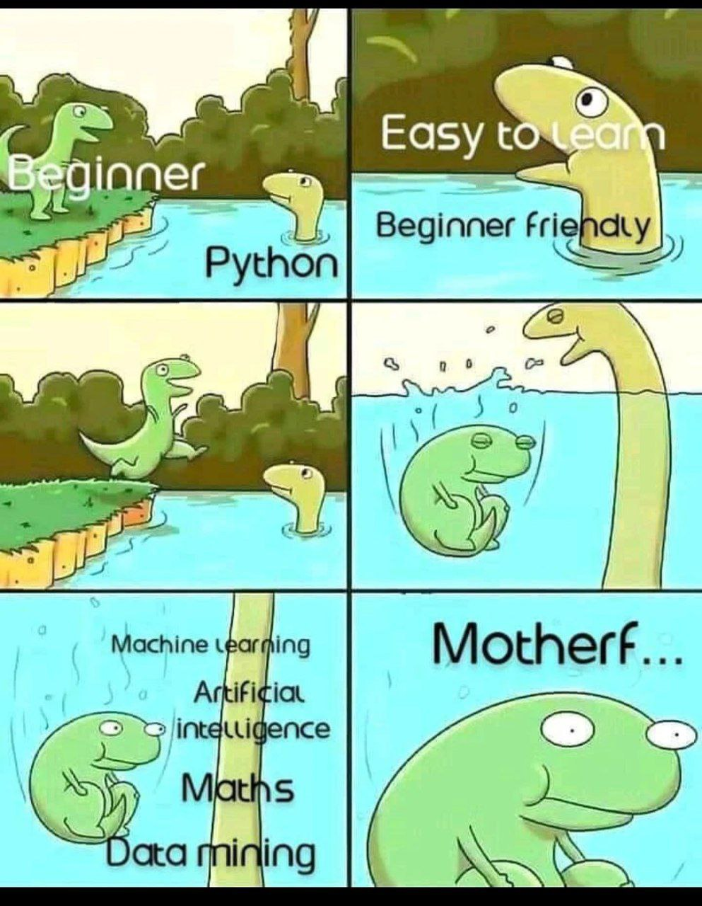

# COE/CSE

- [COE/CSE](#coecse)
  - [Overview](#overview)
  - [TODO : First Year](#todo--first-year)
  - [TODO : Second Year](#todo--second-year)
  - [TODO : Third Year](#todo--third-year)
  - [TODO : Fourth Year](#todo--fourth-year)
  - [TODO : Difficult Subjects](#todo--difficult-subjects)
  - [TODO : Resources to Study From](#todo--resources-to-study-from)
- [Additional Tips](#additional-tips)
  - [Selecting Programming Language](#selecting-programming-language)
  - [TODO : DSA vs Development](#todo--dsa-vs-development)
  - [TODO : DSA vs CP](#todo--dsa-vs-cp)
  - [TODO : Placements](#todo--placements)
  - [TODO : Stuff which every CS student needs to know](#todo--stuff-which-every-cs-student-needs-to-know)
  - [RESOURCES](#resources)
    - [Communities](#communities)
    - [Tools](#tools)
    - [TODO : DSA](#todo--dsa)
    - [TODO : Software Development](#todo--software-development)
    - [CP](#cp)
    - [TODO : Youtube Channels and videos](#todo--youtube-channels-and-videos)
  - [TODO : Determining Proficiency in A Programming Language](#todo--determining-proficiency-in-a-programming-language)

## Overview

- These are the events which you will experience in 4 years of your engineering in COE (Computer Engineering) and CSE (Computer Science and Engineering)
  - There is no fundamental difference between the two branches
  - Only the order in which subjects are taught is different

| Year | Events                                                                                    |
| ---- | ----------------------------------------------------------------------------------------- |
| 1    | Emphasis on all around education, basic programming, workshops, ELC's                     |
| 2    | Data Structure and Algorithms, Buggy Project, Essential Core Subjects                     |
| 3    | Software Engineering, AI/ML, Core Subjects, Capstone Beginning, Summer interns (Optional) |
| 4    | Placements, Some Core Subjects, Capstone Evaluations                                      |

## TODO : First Year

- All the engineering branches will be taught the same subjects in this year but in different order
- For example, the subjects which students of Non-CS branches (Civil,Mechanical, Chemical etc) will be studying in first semester will be the same subjects you will study in second semester

- **You are at a stage where exploration is your main goal**

  - There is no need to rush to "Get the 40 LPA package" as said by any random youtuber
  - Neither do you need to hustle for side income or do freelancing. ~~thand rak bc~~ Have some patience (unless your financial situation is really dire.)
  - Build your foundation, determine what excites you and work towards it

- Focus on your academics . [CGPA and Scholarships Section. (Click here)](../Thapar_Info.md)

## TODO : Second Year

## TODO : Third Year

## TODO : Fourth Year

## TODO : Difficult Subjects

| Name                    | Year | Why Difficult                               |
| ----------------------- | ---- | ------------------------------------------- |
| Engineering Mechanics   | 1    | Numericals require practice                 |
| Electrical              | 1    | Numericals require practice                 |
| Optimization Techniques | 2    | Numericals require practice + Lengthy Paper |
| Operating System        | 2    | Theory + Practice                           |
| Compiler Desgin         | 3/4  | Theory + Practice                           |
| Computer Graphics       | 3/4  | Theory + Practice                           |

## TODO : Resources to Study From

- Resources to study are given as follows
- For each youtube link, check the playlist of the channel to see whether they teach what you want
- Tally the syllabus taught in college and the video

1. https://www.youtube.com/c/MKSTUTORIALSbyManojSir/playlists
   1. Engineering Mechanics is pretty well explained
2. https://www.youtube.com/c/DrGajendraPurohitMathematics/playlists
   1. This guy will save your "Numerical Analysis", "Optimization Techniques" and to some extent, mathematics-2
3. https://www.youtube.com/c/MathPod/playlists
   1. Thapar Faculty Youtube Channel
   2. Optimization Techniques
4. https://www.youtube.com/c/GateSmashers/playlists
   1. One of the best channels for Engineering Concepts
   2. OS,DBMS,Compiler and many more
5. https://www.youtube.com/c/KNOWLEDGEGATE_kg/playlists
   1. One of the best channels for Engineering Concepts
   2. OS,DBMS,Compiler and many more

# Additional Tips

## Selecting Programming Language

- Usually, General Purpose progrmaming languages (like C++, Java, Python, Javascript etc.) are almost similar and there is no specific advantage in learning either
- Once you know one programming language, you can easily learn others. The knowledge is transferrable

```
- My suggestion : Start from C++ / Java
  - These languages are the old school languages.
  - The fundamentals which you learn from them are applicable to majority of programming langauges
  - Once you are able to learn them, you can pretty much learn any programming language easily
```

- To determine how proficient you are at a language, refer to [THIS](#todo--determining-proficiency-in-a-programming-language)
- Python is a popular general purpose language. See the meme below



- A list of popular programming languages (and their common uses) are as follows

| Language   | Domains                                                                       |
| ---------- | ----------------------------------------------------------------------------- |
| Python     | Machine Learning and Data analysis, Webdev (Django), Automation Scripting     |
| R          | Machine Learning, Data analysis, Statistics                                   |
| Javascript | Web development (Both frontend and backend), Mobile Development(React Native) |
| Solidity   | Blockchain (Writing smart contracts)                                          |
| SQL        | Database                                                                      |

## TODO : DSA vs Development

- DSA is a foundation for development
- You can learn to develop through youtube tutorials, courses etc. HOWEVER what DSA will teach you is problem solving.
- Problem solving is independent of tools used and thus, by having a good base of DSA, you will be able to learn development with relative ease.
- An important aspect of being a software engineer is following good programming practices. Refer to [Resources](#resources)

## TODO : DSA vs CP

- DSA is a foundation for CP
- CP is really good to be indluged in HOWEVER if you are not careful, you may learn a few habits which can later be a hinderance in software development job
- You can be a software engineer with good DSA + good development skills
- Phases to learn CP
  - [Learn DSA](#the-phases-to-learn-dsa)
  - CP Algorithms (https://cp-algorithms.com/)

## TODO : Placements

## TODO : Stuff which every CS student needs to know

| Stuff                        | Importance                   |
| ---------------------------- | ---------------------------- |
| Linux                        | Essential                    |
| Linux Command line           | Essential (95% of times)     |
| Github                       | Essential                    |
| Docker                       | Optional / Essential (?)     |
| Vscode                       | Essential                    |
| WSL                          | Highly Useful (Windows only) |
| Windows / Linux Shortcuts    | Highly useful                |
| Stackoverflow                | Essential                    |
| Environment Variables (PATH) | Essential                    |

- Linux is primarily the OS used by developers
  - Linux is an open source Operating System (yes, an open source OS!)
  - Open Source means that the code is available publically and anyone can use the code and improve upon it
  - In simple terms, Linux is a free OS
- There are lots of various "distros" (editions / variations of linux)
- Watch This : https://youtu.be/zA3vmx0GaO8

## RESOURCES

### Communities

- https://www.reddit.com/r/developersIndia/
-

### Tools

- A text editor which is used by the professionals : VSCODE (Visual Studio Code). https://www.youtube.com/watch?v=WPqXP_kLzpo
- Vscode Top Tips : https://www.youtube.com/watch?v=u21W_tfPVrY
- Setting up a basic environment which will allow you to use functions of both windows and linux (limited functions of linux. Basically terminal) : https://www.youtube.com/watch?v=-atblwgc63E
- A wiki which is like a roadmap for developers: https://wiki.devsindia.in/index.html
- A subreddit which can be used for gaining guidance : https://www.reddit.com/r/developersIndia/
- C/C++ code using Vscode and WSL : **NOTE TO SELF : MAKE A TUTORIAL**

### TODO : DSA

- https://wiki.devsindia.in/faqs/how-to-start-dsa.html

### TODO : Software Development

### CP

### TODO : Youtube Channels and videos

**Youtube Channels**

- [Striver / TakeUForward](https://www.youtube.com/@takeUforward) : The guy who made placements easy. His tutorials are top notch. Combine this with @TheAdityaVerma and your DSA skills are set
- [Aditya Verma](https://www.youtube.com/@TheAdityaVerma) : `The guy who made DP Easy`. Beautiful DSA tutorials.
- [Hello World](https://www.youtube.com/@HelloWorldbyprince) : A really refreshing channel. He teaches in a slow pace and _[This playlist](https://www.youtube.com/playlist?list=PLzjZaW71kMwTGbP1suqY16w1VSb9ZNuvE)_ is something which I recommend to every student
- [Pepcoding](https://www.youtube.com/@Pepcoding) : Beautiful DSA tutorials and some software development tutorials too. They use Hava as their primary programming language. If interested, they have paid programs
- [Code With Harry](https://www.youtube.com/@CodeWithHarry) : Software development channel in Hindi
- [Freecodecamp](https://www.youtube.com/@freecodecamp) : An aggregator for quality courses in programming in different fileds
- [Fireship](https://www.youtube.com/@Fireship) : The best channel for combining programming and humor. He teaches you stuff and keeps you entertained
- [Programming with Mosh](https://www.youtube.com/@programmingwithmosh) : Beautiful JS tutorials (also has courses on Udemy)
- [Net Ninja](https://www.youtube.com/@NetNinja) : For web2 development
- [Code Eater](https://www.youtube.com/@CodeEater21) : For web3 development

**Videos and Playlist**

- https://www.youtube.com/playlist?list=PLzjZaW71kMwTGbP1suqY16w1VSb9ZNuvE : A beautiful playlist to start solving DSA problems. He teaches you from the ground up and tackles easy problems, focusing on the thought process.

## TODO : Determining Proficiency in A Programming Language

- If you can do the following in a programming language, you are pretty much proficient in it
- After this, each language has its specific quirks which you need to learn separately

```
Only General Purpose Languages are considered
```

- [ ] Basics
  - [ ] Displaying Hello World / Namaste Duniya
  - [ ] Declaration of variables
  - [ ] Different variable types
  - [ ] Taking user input
- [ ] Math
  - [ ] Basic Arithmetic (Addition, Subtraction, Division, Multiplication)
  - [ ] Intermediate Arithmetic (Modulo)
  - [ ] Modulo of negative numbers
  - [ ] Floating point numbers (floats)
  - [ ] Math Libraries (if any). Math functions like Floor,Ceil,Round etc.
- [ ] Conditionals (If/Else)
  - [ ] Logical Operators (AND,OR,NOT,NOR,XOR)
  - [ ] Nested Conditionals
  - [ ] Switch-Case
- [ ] Looping
  - [ ] For Loop
  - [ ] While Loop
  - [ ] (Optional) Do While loop
  - [ ] [Basic Patterns](https://www.tutorjoes.in/c_programming_tutorial/for_loop_pattern_examples) (Must do as this well help you practice for-loops)
  - [ ] (Optional but super useful) For Each loop
  - [ ] (Python Specific) Enumerates
  - [ ] Break and Continue Statement
- [ ] Arrays / Lists (For each datatype)
  - [ ] Creation
  - [ ] Accessing Elements
  - [ ] Insert
  - [ ] Delete
  - [ ] Getting Length
  - [ ] (Optional) Slicing of array
  - [ ] Accessing elements using for loop
  - [ ] 2D Arrays
- [ ] [Characters and ASCII Code](https://www.ascii-code.com/). No need to remember the full table, just remember the following

```
-> Numerical Digits 0-9 (48-57)
-> Upper Case Characters (A-Z) (65-90)
-> Lower Case Characters (a-z) (97-122)
```

- [ ] Character to ASCII and ASCII to Character conversion
- [ ] Strings
  - [ ] Creation
  - [ ] Displaying
  - [ ] Checking whether strings can be modified or not (specific to each programming language)
- [ ] String Operations
  - [ ] String Length
  - [ ] Concatenation
  - [ ] Padding
  - [ ] Trimming
  - [ ] (Optional) Converting to list (array)
  - [ ] (Optional) Converting an array to string
- [ ] Functions
  - [ ] Creation
  - [ ] Usage
  - [ ] Lambda function (optional)
  - [ ] Call by value and call by reference
  - [ ] Pointers (mostly used in C and Java)
- [ ] Object Oriented Programming (OOPS)
  - [ ] Creation of classes
  - [ ] Inhertiance
  - [ ] Abstraction
  - [ ] Overloaded functions
  - [ ] (optional) Overloading operators
  - [ ] How to create an instance / object of a class
- [ ] File Handling
  - [ ] Opening a file
  - [ ] Reading from a file
  - [ ] Writing to a file
  - [ ] Appending to a file
